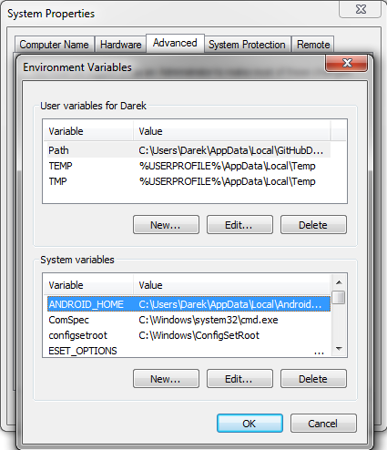
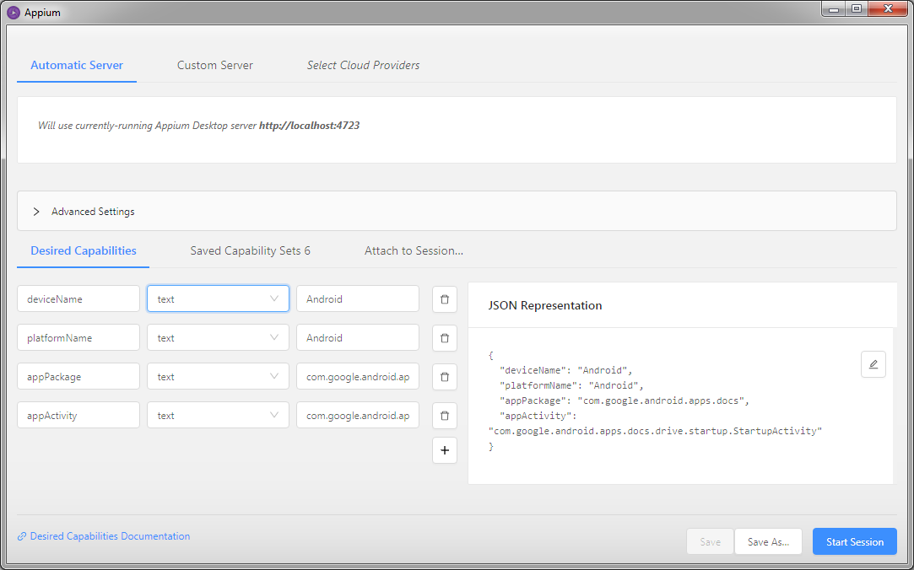
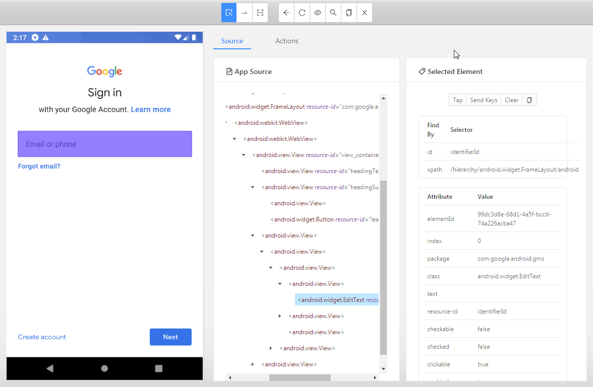

# Appium Addon

Ever wanted to automate tasks on mobile apps? Now it’s possible with our G1ANT.Appium addon. Appium is a derivative of Selenium (browser automation package) and allows to communicate with mobile apps on a physical phone or emulated phone environment (virtual phone).

1. Download and install [Node.js](https://nodejs.org/en/download/).

2. Download and install [Android Studio](https://developer.android.com/studio).

3. Run Android Studio and in *Welcome to Android Studio* window click *Configure* button at the bottom. Click *SDK Manager* in the resulting list.

4. In *Android SDK* system settings window select an appropriate Android version: in case of a virtual phone, you can leave the latest version selected, but when you want to test Appium on a physical phone, be sure to check the Android version of your phone. Click *Apply* button to download and install this SDK. In case of any doubt, please refer to [this documentation](https://developer.android.com/studio/intro/update?utm_source=android-studio#sdk-manager).

5. Copy the path provided in the *Android SDK Location:* field of SDK Manager window:

   

6. Open Windows System Properties: press **Win+Pause** keyboard shortcut, click *Advanced system settings* in the left part of the displayed *System* window and on the resulting *Advanced* tab of *System Properties* window click *Environment Variables…* button.

7. In *System variables* section of *Environment Variables* window click *New…* button. The *New System Variable* dialog box will appear. Enter `ANDROID_HOME` as a variable name and paste the path copied from the SDK Manager into the *Variable value* field. Click OK to close the dialog box. Now *Environment Variables* window should contain this entry:

   

8. Restart your computer.

Now, depending on what type of phone you will use for testing — physical or virtual — you should install either an ADB driver to enable communication with a physical phone, or create a virtual machine with the Android Studio’s AVD Manager.

## Physical Phone (Hardware Device)

1. Download and install an ADB driver developed by [your phone manufacturer](https://developer.android.com/studio/run/oem-usb.html) or a [universal one](http://adbdriver.com/downloads/).
2. Enable ADB debugging on your device by referring to [this document](https://developer.android.com/studio/command-line/adb.html#Enabling).
3. Connect your computer to your device with a USB cable. Make sure the MTP protocol for file transfers is used on the device, not a “mass storage” or “USB charging”.
4. When you start using G1ANT.Appium addon or Appium desktop application, accept all installation/access requests on your device. Appium Settings app will be installed automatically on the phone.

In case of any problems, please refer to [this article](https://developer.android.com/studio/run/device).

## Virtual Phone (Software Emulation)

1. Run Android Studio and in *Welcome to Android Studio* window click *Configure* button at the bottom. Click *AVD Manager* in the resulting list.
2. At the bottom of *Android Virtual Device Manager* window click *Create Virtual Device* button. Select a desired version of an Android device: Pixel 2 is a good choice. Click *Next*.
3. In *System Image* window select a desired Android version for the chosen device and click *Download* to start downloading this system image.
4. When the downloading is finished and the system image is installed by Component Installer, click *Finish*, change AVD properties as needed on the Verify Configuration page and click *Finish*.

Your Android virtual machine should now be ready to use in the AVD Manager — just click play button to start it.

If you encounter any problems, please refer to [this article](https://developer.android.com/studio/run/managing-avds).

## Mobile App Packages and Activities

Appium addon (and Appium desktop application) requires providing two essential information about the mobile app you want to automate: app package name (app name as seen by Android system) and activity (app screen you want to work on). You can find this data on the internet or install a useful mobile tool such as [Apk Info](https://play.google.com/store/apps/details?id=com.wt.apkinfo), which displays every detail on an app chosen from the list of all apps installed on your device.

## Appium Desktop

In order to create any automations on mobile apps, it’s essential to know what elements are available in an app and what properties they have, so that you can tell the robot where to click, scroll, send keyboard input or get text from. Appium Desktop application will help you with that.

1. Download and install [Appium Desktop](https://github.com/appium/appium-desktop/releases/latest).

2. Launch Appium and click *Start Server* button.

3. In the black Appium window click a magnifier icon in the upper right corner to start inspector session.

4. In the lower section under *Desired Capabilities* you will see three input fields and a *JSON Representation* box, where the data entered in the input fields will be displayed in JSON format. Add four entries: `deviceName`, `platformName`, `appPackage` and `appActivity`. They all will be `text` elements, with the first two containing `Android` value. The remaining two will contain the mobile app package name and activity you want to automate.

   For example, in case of Google Drive mobile app, these fields will look like this:

   

5. With your device connected or virtual machine started, click *Start Session*. Appium will automatically connect to the physical or virtual device and launch the desired app.

6. The resulting connected app window consists of three panes: device screen preview, app source tree and selected element properties. You can select app elements by clicking them in the preview pane or, if an element is hard to click or find, select it in the app source tree pane (remember to expand the branches first).

   Here’s the Appium inspection window for a clean Google Drive app (no Google account connected), with an email/phone field selected and its properties displayed in the right pane:

   

   You can see the `id` (*identifierId*) and `xpath` (a long line starting with */hierarchy/android.widget.FrameLayout/android.widget.LinearLayout/…*) selectors for this element.

7. It is possible to tap an element or send keystrokes to it, using appropriate buttons above the element’s properties.

In case of any doubts regarding Appium Desktop application, please refer to [its documentation](https://github.com/appium/appium-desktop).
