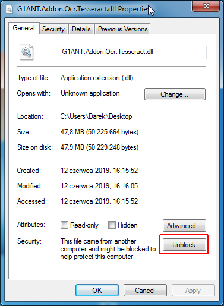
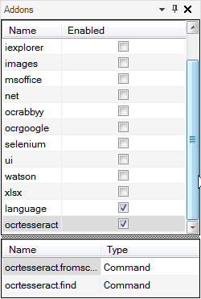

# OCR Tesseract Addon

The OCR Tesseract Addon is not a part of a G1ANT.Studio platform download and you need to install it manually. Follow these simple steps:

1. Exit G1ANT.Studio application if it’s already running.

2. Download [this file](https://drive.google.com/file/d/1j8gWzDgvy2KFpKTX7xbI8JpNHYaroPmq/view?usp=sharing) (click the link and choose *Download* on the resulting Google Drive page) and save it either in the same directory as the G1ANT.Studio’s EXE file or in (My) Documents > G1ANT.Robot > Addons directory.

3. Right-click the downloaded file and choose *Properties* from the context menu.

4. Click *Unblock* button in the bottom right part of the resulting window:

   

5. Run G1ANT.Studio.

The OCR Tesseract Addon should now be available in the Addons panel. Click the check box next to `ocrtesseract` to enable the addon:

