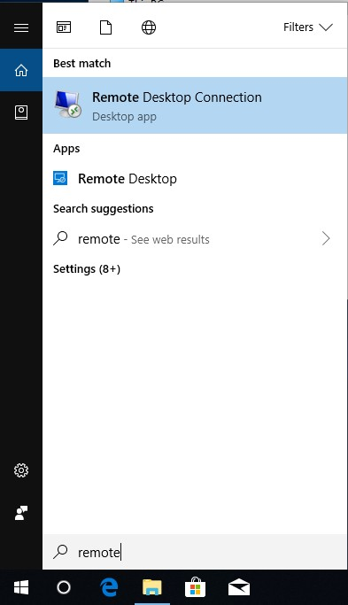
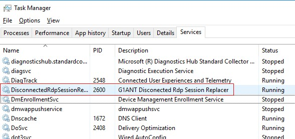

# RDP Controller

RDP stands for Remote Desktop Protocol and is the foundation for remote desktop connections in Windows. With RDP you can connect to a remote computer running Windows and use it as if it was your local machine.

Our RDP Controller is a tool for running G1ANT.Robot automations on a remote PC: you just connect to a remote computer with the standard Remote Desktop Connection app in Windows, start a local robot script on this connected system, and then you can minimize or even close the remote connection client. The script will continue the execution without disturbance.

In order to start using the RDP Controller, you have to follow these steps:

1. Download and run [this file](../-assets/RDP%20local%20machine.reg) on your local Windows system, answering *Yes* to the security warning message.

2. Launch Remote Desktop Connection tool in Windows: type `remote` in the Windows Search box (*Windows 7:* click Start Menu, then use the search box; *Windows 8 and above:* click the Search icon on the taskbar) and click the name of the app in the search results. You can also select the tool in the Accessories (Windows 7) or Windows Accessories (Windows 8 and above) folder of the Start menu (click All Programs first in case of Windows 7).

   

3. Enter username and password of the user on the remote machine.

4. Launch G1ANT.Robot on the remote machine, go to `Tools/Installers` menu and select `RDP Controller`. You will need administrator rights to install the RDP Controller.

5. In the resulting RDP Configuration dialog box enter the same credentials you provided in step 3.

6. Click Yes in the security warning message box. Wait until the command line installer finishes its work and when it does, press any key to close the command line window.

   To check if the RDP Controller was successfully installed, open Windows Task Manager (press **Ctrl+Shift+Esc**) go to Services tab and look for *Disconnected Rdp Session Replacer* service. If it’s there and running, the RDP Controller is ready for use.

   

7. Run your script.

Now you can minimize the remote desktop window or close it altogether.

**Note:** the two Registry keys, which are added by our file installed in step 1, allow minimizing the remote desktop window without affecting the robot and its script execution. Without these Registry entries the automation will not work correctly when the RDP client is minimized.

To uninstall the RDP Controller from the remote machine, launch G1ANT.Robot, go to `Tools/Installers` menu, select `RDP Controller`, delete the credentials in the RDP Configuration dialog box and click Save. The RDP Controller will uninstall itself.

For more information on Remote Desktop in Windows, please refer to Microsoft’s support articles for [Windows 7](https://support.microsoft.com/en-gb/help/17463/windows-7-connect-to-another-computer-remote-desktop-connection) and [Windows 10](https://support.microsoft.com/en-ca/help/4028379/windows-10-how-to-use-remote-desktop).
