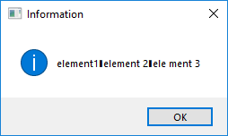
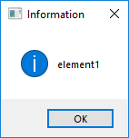
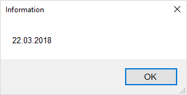

# Array Separator

## Syntax

```G1ANT
♥list = element1❚element 2❚ele ment 3
```

## Description

You can define array variables — lists, to be precise — in G1ANT.Language. A list is used to store multiple values, which can then be passed to a command. It is not possible to use multiple variable types in the same list.

An array separator `❚` is available from `Insert/Array Separator` menu or with **Ctrl+\\** keyboard shortcut.

### Example 1

```G1ANT
♥array = element1❚element 2❚ele ment 3
dialog ♥array
```



In the example above the `♥list` variable contains 3 elements: `element1`, `element 2` and `ele ment 3`. They are all displayed with the `dialog` command.

### Example 2

```G1ANT
♥list = element1❚element 2❚ele ment 3
dialog ♥list1
```



Here, the `dialog` command displays the first element of the `♥list` variable — as specified by `1` index.

### Example 3

```G1ANT
♥list = list:date12/12/2007❚1/2/2017❚22/3/2018
dialog ♥list3
```



In the first line the `♥list` variable is declared as a list of date type elements. The third element called by the `dialog` command will be displayed in a proper date format.
