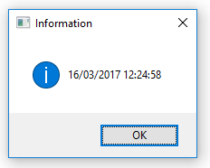

# Macro

## Syntax

```G1ANT
⊂ C# code here⊃
```

## Description

Macro special characters `⊂⊃` allow to include C# code in between them. The code will be evaluated during the run and the result will be returned to your G1ANT variable. The macro characters are available from `Insert/Macro` menu or with **Ctrl+9** keyboard shortcut.

### Example 1

In this example, you will use a C# snippet to display current date and hour. In order to do this, you will also convert this C# data type to a G1ANT type called `datetime`:

```G1ANT
♥macro = datetime⊂DateTime.Now⊃
dialog ♥macro
```



### Example 2

```G1ANT
♥initial_number = 9
♥factorial = ⊂(new Func<int, int>((n) => { int factorial = 1; for (int i = 1; i <= n; i++) factorial *= i; return factorial; })).Invoke(♥initial_number)⊃
dialog ♥factorial
```

Here, you are inserting a C# macro code straight into G1ANT.Robot — it's contained within `⊂⊃` characters. Using delegates `(new Func<object,object>((x)=>{ x ...; x...; return x;})).Invoke(♥value)` is a method enabling the insertion of more statements into one macro. Inserting C# macros is an advanced tool in G1ANT.Robot that expects prior knowledge of C#.

