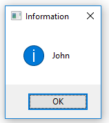
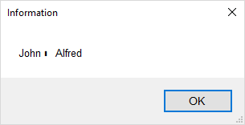

# Search Place

## Syntax

```G1ANT
✱part of text✱
```

## Description

Search place character `✱`  is used within the text.find command to specify location for text search. If only a part of the text to find is known, or you wish to find ANYTHING in the text, this special character shall highlight the ANYTHING.

You can insert this character from `Insert/Search Place` menu or with **Ctrl+8** keyboard shortcut.

### Example 1

You want to search for a text stored in a variable, and get everything between texts `Name:` and `Surname:`. 

```G1ANT
♥source = ‴Name: John Surname: Smith‴
text.find ♥source search Name:✱Surname: result ♥name
dialog ♥name
```



### Example 2

When there are more elements matching your query, the result is an array (a list). More on arrays [here](array-separator.md).

```G1ANT
♥source = ‴Name: John Surname: Smith Name: Alfred Surname: Smith‴
text.find ♥source search Name:✱Surname: result ♥name
dialog ♥name
```



