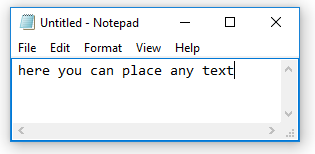

# Text

## Syntax

```G1ANT
‴The text to use or save‴
```

## Description

Text special characters `‴‴` are required to declare text value containing spaces for arguments in all available commands. This text can be used for displaying messages, storing file paths, as an input in documents or dialog boxes etc., and can also be assigned to variables.

There is no need to use these characters if text doesn't contain spaces.

You can insert these characters from `Insert/Text` menu or with **Ctrl+'** (apostrophe) keyboard shortcut.

### **Example**

```G1ANT
program notepad
keyboard ‴here you can place any text‴
```



In the first line the text contained within triple quotes is a name of the program to be run. The text in the next line should be entered by the `keyboard` command in the launched program.

