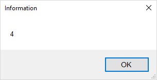
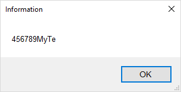

# Variable Index

## Syntax

```G1ANT
♥variable⟦position⟧
```

```G1ANT
♥variable⟦start:end⟧
```

## Description

In G1ANT.Language particular indices (characters) in variables can be addressed. Using `a:b` notation, whole ranges of indices in variables can be addressed.

You can insert the variable index characters from `Insert/Variable Index` menu or with **Ctrl+\[** keyboard shortcut.

### Example 1

```G1ANT
♥str = ‴123456789MyText‴
dialog ♥str⟦4⟧
```



In this example the fourth character of the text variable `♥str` is displayed.

### Example 2

```G1ANT
♥str = ‴123456789MyText‴
dialog ♥str⟦4:13⟧
```



In this example, characters starting from the fourth up to the thirteenth position of the text variable `♥str` are displayed.