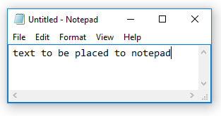

# Variable

## Syntax

```G1ANT
♥myvar = ‴some text‴
```

```G1ANT
♥myvarnumber = 773
```

## Description

The variable special character `♥` is placed before the name of a variable. Any value from all possible types of structures can be assigned to a variable.

You can insert this character from `Insert/Variable` menu or with **Ctrl+4** keyboard shortcut.

### Example

```G1ANT
♥text = ‴text to be placed in Notepad‴
program notepad
keyboard ♥text
```



