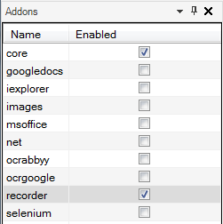
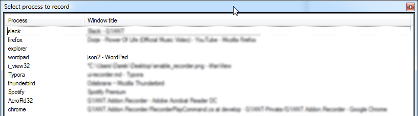
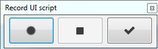
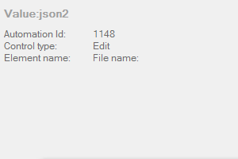
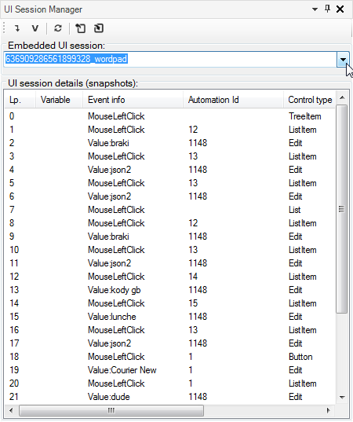
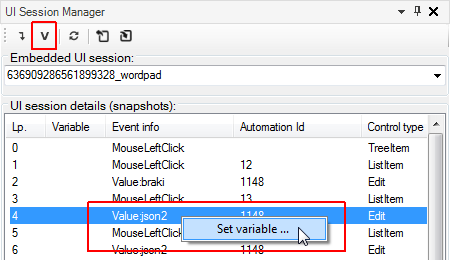
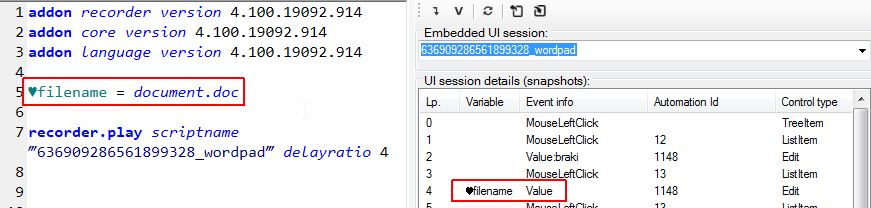
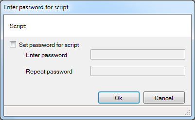

# UI Recorder

The UI Recorder addon is a special tool designed to create embedded scripts based on recorded user actions. You could compare it to macro recording functions in such applications as MS Office or Adobe Photoshop.

>**Note:** This addon is in the beta phase and therefore is not included in G1ANT.Studio. Feel free to test it by downloading the file from [here](https://drive.google.com/file/d/1X_8Xb0NFzx3YgGGdJvgL09axgqh4nXas/view?usp=sharing) (right-click the link and choose *Save link/target as…* from the context menu) and save it either in the same directory as the G1ANT.Studio’s EXE file or in (My) Documents > G1ANT.Robot > Addons directory.

## How to Use

1. In order to use this addon, you need to activate it first, just like you do with any other addons: in the Addons panel to the left of the G1ANT.Robot window click to select the box next to the `recorder` item, thus enabling the addon.

   

2. Now, select `UI Script` from `Insert` menu.

3. In the resulting *Select process to record* window select the application, in which you want your actions to be recorded. In this example WordPad was selected:

   

4. The selected application should be brought to the foreground and a special recording panel should appear with the buttons to start and stop recording or exit the recorder.

   

5. To start recording your actions, just click Record button and perform actions in the selected application. Every successfully recorded action will be previewed in a summary window, which is displayed for 5 seconds above the recording buttons:

   

   A red window background means an error in event handling by the recorder.

6. When you are done, click Stop button. If you don’t want to record more actions, click Exit button.

7. The `recorder.play` command along with the script name of recorded actions is automatically added to your code. You can also use the optional `delayratio` argument, which sets a replay delay between consecutive actions as a factor of 250ms (the `delayratio` set to 4 means 1s delay).

   

When you run the robot script, all recorded events will be executed. Any errors which might occur during the execution of the UI script will not stop it. To stop the UI script, stop the process by pressing **Ctrl+F12**.

## Changes to the Recorded Script

It is possible to change some values recorded in the UI script:

1. Define a variable in the robot script, for example

   ```G1ANT
   ♥filename = document.doc
   ```

2. Select `UI Session Manager` from `View` menu. A new panel appears on the right of the script editor. Here, you can select a script with recorded actions, view its content, set variables and import/export UI scripts from/to a file.

   

3. Select the desired UI script from the *Embedded UI session* drop-down list.

4. For the *Value* events you can set variables declared in the robot script: just right-click a *Value* item and select *Set variable…* from the context menu or click `V` button on the panel’s toolbar.

   

5. In the resulting *Variable* dialog box enter the name of a variable you want to use in the UI script. In this case, it would be the `♥filename` variable declared before:

   

When you run your robot script, the value stored in the  `♥filename` variable will be passed to the UI script, so the element *document.doc* will be clicked in WordPad.

## Saving UI Scripts

In order to preserve UI scripts in robot scripts, it’s required to save your scripts in binary format, which is the default setting when at least one UI script is present. What’s more important, when you enter a name for the binary file, you will be provided with an option of password-protecting the file:


