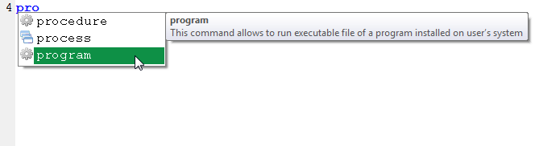
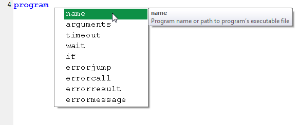
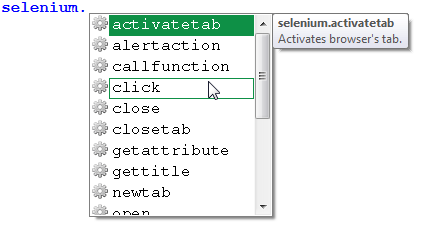

# Basics

When you learn new language, you always start with basics: pronunciation, spelling, fundamental vocabulary, general rules of constructing sentences and expressing your thoughts. The same applies to any programming language, where you learn its commands, arguments, syntax and all the rules that make it logical.

G1ANT.Language is no different, so before you start creating robots, you must know the foundations, on which you can build your scripts. We will guide you through language basics and present you with the elementary tools, which help you in writing your code.

## Workspace

G1ANT.Robot program offers you powerful and convenient tools to help you master all aspects of programming in G1ANT.Language to robotize and automate common and repetitive tasks.

### Suggestions and Tooltips

The script editor is equipped with IntelliSense technology, which gives you suggestions while you type. It’s an extremely comfortable and productive variation of an interactive help.

How does it work? When you start typing, IntelliSense looks for matches in the language dictionary and displays them in a drop-down list. A description of the selected item appears in a tooltip — a small box to the right with a brief explanation of what a particular element does.

For example, start typing `program` in the script editor. With every letter, the suggested list of matching entries narrows down: five items in the list after you type “p”, then just three, when you press “r”, and when you reach “g”, there’s only `program` left to choose. But IntelliSense doesn’t stop there: after selecting an item from the suggested options, you are prompted with further language elements — arguments then their values. In case of the `program` command, when you pick it and press space, you will see a list of nine arguments available for that command along with their descriptions in tooltips:





This way, not only you don’t make obvious typo mistakes, but also create code with correct syntax and learn how to use G1ANT.Language efficiently.

Remember that whenever the list with suggestions disappears, you can reactivate it by pressing **Alt** key.

### Panels

Panels are another helpful and handy element of G1ANT.Robot user interface. We described them in detail in the [other part](../g1ant.robot-window/panels.md) of this manual, so you can learn about them there. In a nutshell, these are lists of objects available in G1ANT.Language (there are panels containing other information, but we won’t discuss them now). You can have them displayed, so that you will see what commands (and their arguments), structures, variables and symbols you have at your disposal and fingers.

### Keyboard shortcuts

They help you to work faster — simple as that. Instead of moving around menus and clicking, use keystroke combinations to get what you want in a fraction of time. Keyboard shortcuts for menu items are shown next to them in the menus, and next to special characters in Symbols panel. For example, instead of navigating to `Edit/Find` menu for a Find tool, you can simply press **Ctrl+F** keys.

You can also find all [common keyboard shortcuts](../appendices/windows-keyboard-shortcuts.md) (typical for Windows and its applications) as well as Windows key shortcuts in our Appendices section.

## Language Syntax

G1ANT.Language syntax is pure and simple:

```G1ANT
command argument value 
```

As you can see, you always start with a command followed by its argument and then a value of that argument. Compare this with natural language: if you say *“pass this cat to me”*, “pass” would be a command, “this” and “to” — arguments, “cat” and “me” — values.

Now, let’s learn who is who — or rather what is what.

### Command

Is an instruction given by a user telling the robot to do something — for example, run a program or perform keyboard or mouse action. You could compare commands to verbs in natural language.

A command can be simple, one-word, like `dialog` or extended, like `selenium.open`. Two-word commands separated with a dot in the middle belong to a family of commands. It means that there are other commands starting with `selenium.` and their suffix (the part following the dot) expresses certain activity: `open`, `newtab` ,`switch`.

Each family of commands has its special ‘activities’. Once you start typing the command inside the script editor window, a list of available activities will pop up, as you can see below:



### Argument

A command needs to know, what exactly it is supposed to do. So, usually you must provide some information — and this data is called an *argument*. For example, when you type `program`, the robot will suggest you next input in a drop-down list and the first item will be `name`. It is an argument for the `program` command followed with a name of the program to be launched. So, if you wanted the robot to open Notepad, you would write `program name notepad` — remember the “command argument value” rule?

### Value

The content of a field or a variable is called a *value*. It can refer to alphabetic as well as numeric data. For example, in the expression

```G1ANT
selenium.open type firefox url google.com result ♥google
```

the elements `firefox` and `google.com` are values.

>**Note:** If the text values contain spaces, they must be embraced with triple prime characters available by pressing **Ctrl+'** (apostrophe) keyboard shortcut or by clicking the text symbol icon on the toolbar.

Values always belong to one type of structures, variables, and they can be any text, numbers and a mixture of both (URL address, for instance). Values are strictly related to their arguments.

### Examples

In the following example the golden “command-argument-value” rule is a bit twisted:

```G1ANT
text.read c:\Users\♥USERNAME\Desktop\g1ant.txt result ♥g1
```

The `text.read` command is immediately followed by a value (`c:\Users\♥USERNAME\Desktop\g1ant.txt`), not an argument. It’s because first arguments can be omitted, since they are obvious. In this case, the missing argument is `filename`, which is followed by a value with the name of a file to open. Then, there is the `result` argument and its `♥g1` value.

Other examples of arguments that can be skipped and replaced by their values, include `name` for the `program` command (which specifies the program to be launched) or `title` for the `window`command (which specifies the title of the window to focus on):

`program notepad` instead of `program name notepad`

`window ✱chrome` instead of `window title ✱chrome`

Note the special asterisk symbol before `chrome`: it's called Search Place and serves as a wildcard for all characters preceding the word “chrome”, so that any Google Chrome browser window would be selected no matter what its full title is. You can enter this character from `Insert/Search Place` menu, with **Ctrl+8** keyboard shortcut or by clicking the ✱ icon on the toolbar.

## Using Variables

Since we are talking basics, we have to mention this: variables. And even if you have experiences with programming languages, and therefore you surely know what a variable is, there’s one small and lovely thing you need to know about it in G1ANT.Language.

### What Is a Variable?

A variable is like a named box or a container, which can store values that may change (or vary — hence the name) during the program execution. A variable named, say, *number* can be equal to 1, 20, 0.18 or other number you put in it. A variable can also contain text or other types of data, including formatted ones like date.

### How To Use It?

Here in G1ANT we love variables and we decided to show our affection by adding hearts to them. So, if you want to declare or use a variable, you have to insert a heart symbol followed by the name of a variable: `♥number`.

The special character ♥ is the prefix for all variables in G1ANT.Language. You can enter this symbol by pressing **Ctrl+4**, clicking on its icon in the toolbar or selecting it from `Insert/♥ Variable` menu. For those more experienced: it's like `$` in PHP language.

### Example

Copy and paste this code into the script editor, then run the robot by pressing **F9** key or clicking Run  icon on the toolbar:

```G1ANT
♥number = 2
♥total = ♥number + ♥number
dialog ♥total
```

You will see a dialog box displaying `4`. In the first line you defined a `♥number` variable equal to `2`. In the next line you defined a `♥total` variable, which is a sum of two `♥number` variables. Since 2 and 2 make 4, the `dialog` command will bring up a dialog box showing `4` as the value of the `♥total` variable.

Now you know what a variable is and how to generally use it in G1ANT.Language. And not only just that: you also used the `dialog` command to bring up a dialog box with a message. It’s about time to move on to more exciting stuff involving interaction with user interface.

## Using UI Commands

As an RPA software, G1ANT.Robot has to deal with the user interface of the host operating system, pretending to be a human sitting in the front of a PC. It includes many commands designed to mimic user activity in Windows and its applications. For example, the robot can launch programs, open dialog boxes, ask user for some input, select application windows, enter keystrokes, move mouse cursor and many more.

For the purpose of this introductory guide, let’s take a look at the most fundamental UI-related commands in G1ANT.Language: `dialog` and `dialog.ask`, `keyboard`, `mouse.`, `program` and `window`.

### Show Me a Dialog

Whenever you want to display some information to users, or ask them for some input, the `dialog` and `dialog.ask` commands come in handy. 

Their usage is simple and self-explanatory: you just enter the `dialog` command followed by text or a variable to be displayed or, in case of `dialog.ask` command, by a message to a user and then a variable, in which you want to store the user input.

Type in or copy/paste this script:

```G1ANT
dialog.ask message ‴What is your favorite number?‴ result ♥number
dialog message ‴Your favorite number is: ♥number‴
```

While typing, you will see suggestions and tooltips from IntelliSense, including the triple quote characters, in which you insert your text messages.

The first line tells the robot to display a dialog box asking you for your favorite number. Your answer will be stored in a variable called `♥number`. After clicking OK button in this dialog, the robot executes the next line and brings up another dialog box. It will display a message along with the value of the `♥number` variable — the favorite number you have just entered in the previous dialog.

### Key To Program’s Success

Most of the times when you robotize things rather than displaying robot’s dialog boxes you want to provide some keyboard input into applications you automate. Whether it’s a filename to be entered into the app’s Open dialog box, a text that needs to be inserted in a document, or an action performed with a common keyboard shortcut such as pasting from clipboard with **Ctrl+V**, you will make use of the `keyboard` command. But in order to actually see the results, you either have to launch a program, in which you will enter keystrokes with the `keyboard` command, or select one of the open windows.

Try this script:


```G1ANT
program notepad
keyboard ‴Hello! I'm a robot.‴
```

The first line opens Windows Notepad and the second line enters a text into it.

In case of the `program` command, the most obvious argument is a _name_ of the program to be launched by the robot. This name can be given in a short form such as `notepad`, `calc`, `chrome`, `word` (provided that these programs are installed in the system) or with a full path to the executable file, eg. `‴C:\Program Files\Internet Explorer\iexplore.exe‴` (again, note the triple prime character `‴` embracing the path — it's a special sign used in G1ANT.Robot for values containing spaces; to enter it, press **Ctrl** and apostrophe **'** key).

Sending keyboard inputs to a program is easy and requires the `keyboard` command followed by the text to be entered or keyboard shortcuts/function keys to be mimicked by the robot.

But what if you wanted to make the robot write the text from the example above in two lines instead of just one? Like this:

```
Hello!
I’m a robot.
```

The answer is simple: in the next line after your existing `program notepad` command, you would type


```G1ANT
keyboard ‴Hello!⋘enter⋙I'm a robot.‴
```

Did you notice `⋘enter⋙`? These triple quotation angles (available with **Ctrl+<** and **Ctrl+>** keyboard shortcuts or from the toolbar) indicate a function key or a keyboard shortcut — **Enter** key in this example.

The `keyboard` command is not that primitive as you might think. Well, it is, considering the way it works, but these simple keyboard inputs are much more powerful when you start using keyboard shortcuts. Why? Because every program uses keyboard alternatives for its menus, tools and functions. You only need to find them and pass to your robot.

Let's go back to your simple Notepad robot. Its code looks like this:

```G1ANT
program notepad
keyboard ‴Hello!⋘enter⋙I'm a robot.‴
```

Now you could use common Windows shortcuts such as **Ctrl+C** (copy to clipboard), **Ctrl+S** (save to a file) or **Alt+F4** (close program) to make the robot perform respective tasks. But Notepad allows you to do many other things: all of its tools are accessible with keyboard alternatives, which show up after pressing **Alt** key.

Run your robot by pressing **F9**. With Notepad open, you can investigate available keyboard options: press **Alt** key and look at the menu bar. First menu item, `File`, is selected and all menu items have one letter in their names underlined. Now you can use arrow keys to navigate through menus or press the underlined letter to select a desired menu item. Fo example, if you wanted to activate word wrapping option, which is available in the `Format` menu, you would have to press **O** key (the underlined letter of the Format menu), then **W** in the dropped-down Format menu to select the `Word Wrap` item. The robot command sequence for these keystrokes would look like this:

```G1ANT
keyboard ⋘alt+o⋙w
```

Let's make something more powerful and robotized out of these keyboard inputs: select all notepad content and change its font size to 20. The keyboard shortcuts sequence would be:

1. Press **Alt+F** to open the `Format` menu.
2. Press **O** to select Font tool and bring up its dialog.
3. Press **Tab** twice to navigate to the font size box.
4. Enter the value of **20**.

The robot code would be as follows:

```G1ANT
keyboard ⋘alt+o⋙f⋘tab 2⋙20⋘enter⋙
```

You can use such combination of keyboard shortcuts and keystrokes to perform more advanced editing — for example, to find and replace some words or phrases. Say, you would want to change all instances of *robot* in your Notepad text into *G1ANT.Robot*:

1. Bring up the Replace tool with **Ctrl+H**.
2. In the Replace dialog, enter **robot** in the `Find` box and **G1ANT.Robot** in the `Replace` box.
3. Apply changes by pressing **Replace All** button.
4. Close the dialog with **Alt+F4**.

This translates into the following code in G1ANT.Robot language:

```G1ANT
keyboard ⋘ctrl+h⋙robot⋘tab⋙G1ANT.Robot⋘alt+a⋙⋘alt+f4⋙
```

After all operations, it would be nice to save changes to a text file named *robot.txt* in a deafult location and close Notepad:

```G1ANT
keyboard ⋘ctrl+s⋙robot⋘enter⋙⋘alt+f4⋙
```

Now, add the lines for changing the font, replacing words and saving a file to your first code:

```G1ANT
program notepad
keyboard ‴Hello!⋘enter⋙I'm a robot.‴
keyboard ⋘alt+o⋙f⋘tab 2⋙20⋘enter⋙
keyboard ⋘ctrl+h⋙robot⋘tab⋙G1ANT.Robot⋘alt+a⋙⋘alt+f4⋙
keyboard ⋘ctrl+s⋙robot⋘enter⋙⋘alt+f4⋙
```

Run your robot with **F9** and enjoy its work.

### Of Mice and Windows

One keyboard to rule them all — right, but what would a computer be without a mouse? Mouse is often an indispensable device to support the user interface. G1ANT.Robot is aware of this and offers you `mouse.` family of commands to include mouse actions in your robot scripts.

There are three variations of the `mouse.` command:

1. `mouse.click` sends a cursor to the specified position and performs one of three available mouse click types:

   - `down` for clicking and holding down the mouse button (e.g. when starting selection or drawing),
   - `up` for releasing the mouse button (e.g. when the selection or drawing ends),
   - `press` for a simple click.

   You can specify which mouse button has to be pressed with the `button` argument and how many times it should be clicked with the `count` argument.

2. `mouse.wheel` sends a cursor to the specified position and performs one of two available mouse wheel moves:

   - `verticalsteps` defines vertical wheel movement (positive number for up, negative for down),
   - `horizontalsteps` defines horizontal wheel movement (positive number for right, negative for left).

3. `mouse.move`, as its name implies, merely moves the cursor to the specified position.

All of the `mouse.` family of commands shares also `position` and `relative` arguments.  `position` needs a value representing pixel coordinates and `relative` defines if these coordinates are relative to the upper left corner of the active window (by default) or absolute on the screen (also measured from its upper left corner).

Since we are here with coordinates relative to the active window, it’s necessary to tell the robot, which window should be active for mouse actions. Otherwise, in case a wrong window would be active, the relative position of the cursor could lead to unpredictable results.

The command responsible for selecting a proper window is — guess what? — the `window` command. Not only it brings focus to the window specified by the `title` argument, but it can also set this window’s size (`maximized`, `minimized` or `restored` from minimized) with the `style` argument.

Let’s see `window` and `mouse.` commands in action. For example, you want to select some text in an application. It could be a PDF file with content you can select with a mouse, but not with a keyboard, or part of an email in a browser window. The algorithm for this process would look like that:

1. Select the desired window.
2. Move the cursor to the starting point of the text.
3. Press down the left mouse button and start dragging the cursor over the desired area.
4. Release the mouse button.
5. Copy the selected text.
6. Paste it to the target application.

For the purpose of this exercise, we will stick to the good old Notepad and the previous example. Assume you have an open Notepad window with *“Hello! I’m a robot.”* in it. Let’s try to select *“a robot”* with `mouse.` commands.

First, you have to select the right window:

```G1ANT
window ✱notepad
```

> This command will work correctly only when there’s just one Notepad window open. If you have more of them, you must precisely specify the window you want to use, e.g. `window ‴Untitled - Notepad‴`. The full list of open windows titles is available in [All Windows](../g1ant.robot-window/auxiliary-windows/all-windows.md) tool (`Tools/Windows` menu or **Ctrl+W**).

With Notepad window selected, tell the robot to move the cursor close to the letter “a”, click and start selecting.

Wait, how can you determine the mouse cursor position? Don’t worry, we have you covered: use the [Mouse Position](../g1ant.robot-window/auxiliary-windows/mouse-position.md) tool (`Insert/Mouse Position` menu or **Ctrl+E**) after you type the `mouse.click` command. Answer “No” in the dialog box, since you want a relative coordinates, point your cursor to the right place and click. The tool will insert the resulting position as an argument for you:

```G1ANT
mouse.click point41⫽70 type down
```

> Note that your coordinate values can be a bit different from the ones given here.

Confused with the lack of the `button` argument? You probably expected `mouse.click point41⫽70 button left type down`, didn’t you? Well, you could use it, but it may be skipped in this case, because `left` is the default value. Likewise, if you wanted just to make a mouse click, you could also skip the `type` argument — `press` is its default value.

Now you should tell the robot to move the mouse cursor to the end of the “robot” word and stop selection by releasing the mouse button. Again, use the Mouse Position tool to insert the right coordinates:

```G1ANT
mouse.click point98⫽71 type up
```

OK, you have your text selected. Now copy it and paste somewhere else — in another Notepad window, for example:

```G1ANT
keyboard ⋘CTRL+C⋙
program notepad
keyboard ⋘CTRL+V⋙
```

And that’s it! Your whole script should look like this:

```G1ANT
window ✱notepad
mouse.click point41⫽70 type down
mouse.click point98⫽71 type up
keyboard ⋘CTRL+C⋙
program notepad
keyboard ⋘CTRL+V⋙
```

Run this process with **F9** key and be proud of yourself!

*If you want to learn more about all commands used in this chapter, please refer to their individual descriptions in the [Commands](../indexes/Commands.md) section of this manual.*
