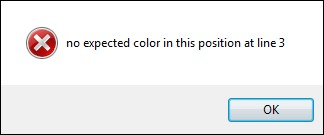

# Common Arguments

Here is the list and explanation of arguments, which can be used with most commands.

## if

This argument followed by a condition, defines whether the command will be executed or skipped. The condition is a C# macro and if the expression contain some spaces, we advise you to paste it within `⊂⊃` for a clearer readability.

### Syntax

| Argument Name | Argument Value | Command Execution |
| ------------- | -------------- | ----------------- |
| `if` | true | yes |
| `if` | false | no |

### Example 1

```G1ANT
♥x = 3
program notepad if ♥x==3
```

In the example above, number 3 is assigned to a variable `♥x`.  The part of the script: `program notepad if ♥x==3` will only be executed, if the condition is true. In this case it is, so G1ANT.Robot **will open** notepad.

### Example 2

```G1ANT
♥x = theater
program notepad if ♥x=="movie"
```

In the example above, word “theater” is assigned to a variable `♥x`.  The part of the script: `program notepad if ♥x=="movie"` will only be executed, if the condition is true. In this case it is false (theater is not equal to movie), so G1ANT.Robot **will not** open notepad.

Please, note that movie has to be in double quotes because that is how strings have to be declared in C#.

### Example 3

```G1ANT
♥x = 3
♥y = theater
program notepad if ⊂♥x==3 & ♥y=="theatre"⊃
```

G1ANT.Robot **will open** notepad, since both criteria are met and the resulting condition is true.

## errorcall

This argument specifies a procedure to call when a command throws an exception (error) or a timeout expires. The procedure name should be preceded by the `➜` special character (**Ctrl+2**).

### Example

The following script tries to select a *Sometitle* window. If it succeeds, the content of the window is copied and then pasted into Notepad. But when there's no such window, an error occurs and the `➤ErrorOccurred` procedure is called. This procedure displays a dialog box with *An error has occurred* message.

Note that when a user clicks OK in the dialog, the procedure ends, but the script continues: the robot goes back to where the procedure was called and tries to select and copy all content of the active window and paste it into Notepad.

```G1ANT
window sometitle errorcall ➤ErrorOccurred
keyboard ⋘CTRL+A⋙⋘CTRL+C⋙
program notepad
keyboard ⋘CTRL+V⋙ 

procedure ➤ErrorOccurred
	dialog ‴An error has occurred‴
end procedure
```

This return to the place of a call in the script is the main difference between `errorcall` and `errorjump` arguments.

## errorjump 

This argument specifies the name of a label to jump to when a command throws an exception (error) or a timeout expires. It allows G1ANT.Robot to omit some part of the script and jump to other part of the script. The label name should be preceded by the `➜` special character (**Ctrl+2**).

### Example 1

In the example below a text is assigned to a variable named `♥text`.

The condition `⊂♥text == "Chris likes bananas"⊃` is false, and since the `errorjump` argument is specified,  G1ANT.Robot jumps to the part of script labeled `➜banana` (the value of the `errorjump` argument). G1ANT.Robot will not display a dialog box with the text *Yes! Chris likes bananas!*, because it will execute `errorjump` and skip the `dialog` command. Instead, all commands within the  `➜banana`  label will be executed. In this case, it would mean displaying a dialog box with the text *Sorry, Chris doesn't like bananas!*

```G1ANT
♥text = ‴Chris likes apples‴
test condition ⊂♥text == "Chris likes bananas"⊃ errorjump ➜banana
dialog ‴Yes! Chris likes bananas!‴
➜banana
dialog ‴Sorry, Chris doesn't like bananas!‴
```

### Example 2

```G1ANT
color.expected position ‴616⫽384‴ color ‴1E1E1F‴ errorjump ➜wrong result ♥name
dialog ♥name
jump ➜end
➜wrong 
dialog message ‴no expected color in this position‴
➜end
```

In this example, if the specified color `1E1E1F` is found in the specified position `616⫽384` on the screen, G1ANT.Robot will open a dialog box displaying contents of the `♥name` variable and then will jump to the `➜end` label. If the color is not found, program will jump to the `➜wrong` label and show a dialog box with *no expected color in this position*.

## errormessage

This argument is simply a message that will be displayed in case a command throws an exception (error) or a timeout expires, and no `errorjump` argument is specified. If `errorjump` is specified, G1ANT.Robot will skip `errormessage`, while executing the rest of the script.

### Example

```G1ANT
color.expected position ‴616⫽384‴ color ‴1E1E1F‴ errormessage ‴no expected color in this position‴
```

If the specified color is not found, the following dialog box is displayed:



## errorresult

This argument lets us choose the name of a variable, which will store the error information. The variable name should be preceded by `♥`.

### Example

The script below tries to select window titled `blah`. In case there's an error, its information will be passed to `♥someError` variable, and then the `➤ErrorOccurred` procedure is called. The procedure opens a dialog box displaying `♥someError` variable's value (error information). In this case, the dialog box will show such message: *Specified window blah not found*.

```G1ANT
window blah errorresult ♥someError errorcall ➤ErrorOccurred

procedure ➤ErrorOccurred
    dialog ♥someError
end procedure
```

## timeout

This argument lets us choose the amount of time (in milliseconds) the robot waits for a command to be executed before throwing an error about time expiration. 

### Example

```G1ANT
chrome ‴google.com‴ timeout 10
```

Obviously, it is very unlikely that a computer would perform such an action within 10ms, so a timeout error occurs.
