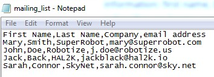

## Unsubscribe Me: Mails, Text Tools And File Operations

The previous exercise with G1ANT.Language was based on Excel and the Robot commands designed for this application (our language also provides specialized commands for Word and Outlook). You learned how to use procedures for clean code and repetitive tasks. Now you can try some more commands to automate desktop apps.

Imagine such a scenario: you run a company, which sends email newsletters to its subscribers. The subscribers list is stored in an ordinary CSV (comma separated values) file — it’s a plain text file with basic information: first name, last name, company name and email address of a subscriber. When your subscriber no longer wants to receive emails from you, he or she sends an email with “unsubscribe” in the subject field and you manually delete this address from your mailing list.



And here the G1ANT.Robot steps in and takes this job from you!

Start with designing an architecture for your script: the plan of actions.

1. Login into your email account.
2. Check for unread emails containing “unsubscribe” in the subject field.
3. If there are any, store the sender’s email address.
4. Open the mailing list .csv file.
5. Search for the stored email addresses and delete them from the list.
6. Save and close the file.

Seems pretty easy. And, in fact, it is with our G1ANT.Language commands.

### Silent Execution

You could do all of the above actions using UI commands you learned in the [Basics](../g1ant-language/basics.md) chapter: `program`, `window` and `keyboard`. They would open your email client (or webmail in a browser), search for “unsubscribe” message subject, copy the sender’s email, then open the mailing list file in Notepad and use its Find and Replace tool to delete the address from the list. But there are less obtrusive ways that do not involve dealing with the user interface and clicking around menus, dialogs and so on. They work directly with the target objects in the background, so users can still do tasks on their PCs.

Take emails, for example. You don’t have to use any external tool such as email client or net browser to check your inbox: there is the `mail.imap` command for it. You simply provide your email account credentials as the arguments and the command gets messages for you, storing them in a variable. Then, you can search this variable for some text and even replace it with the `text.` family of commands.  And this is exactly what you are going to do in this exercise.

### Reading Emails

The whole process described in your plan of actions can be divided into three main tasks: retrieving emails, searching for specific messages and deleting email addresses from the list. Let’s make procedures out of these tasks and name them `checkmail`, `checksubject` and `deleteaddress`.

```G1ANT
procedure checkmail
    
end procedure

procedure checksubject
    
end procedure

procedure deleteaddress
    
end procedure
```

Start with the `checkmail` procedure. It should simply login to your email account and retrieve messages. The `mail.imap` command does it in one fell swoop. What it needs is the email server information, your login credentials and a name of the variable, which will store emails. You can also specify some filtering, which is helpful when processing huge mailboxes: time range (start and end dates of messages), an option to process only unread messages and whether to mark them as read afterwards. The full syntax for the command is as follows:

```G1ANT
mail.imap host ‴imap.server.name‴ port ‴993‴ login ‴your@email.address‴ password ‴p@$$w0rd‴ sincedate ♥startdate todate ♥enddate onlyunreadmessages true markallmessagesasread true result ♥result
```

Let’s assume your script should check only unread messages received since the day before the robot is run. These messages will be marked as read (it’s the default value, so you don’t have to specify it) and will be passed to the `♥emails` variable. So here is your `checkmail` procedure:

```G1ANT
procedure checkmail
	mail.imap host ‴imap.server.name‴ port ‴993‴ login ‴your@email.address‴ password ‴p@$$w0rd‴ sincedate ♥yesterday onlyunreadmessages true result ♥emails
end procedure
```

Of course, you should provide your true server name, login and password in the code above.

There are two variables used in this procedure: `♥yesterday` and `♥emails`. The latter is created automatically by the command (the default name is `♥result`), but the first needs to be declared beforehand. Let’s do it.

### Injecting C# Code

It’s easy to get the current date in G1ANT.Language — all you need is to use the `♥date` special variable. But things get tough when you want to make some operations on a date, for example to add or subtract days. Sometimes it’s better not to invent a wheel, rather to use existing functions from C# language instead. These C# “injections” — called snippets — into G1ANT.Language are done using `⊂⊃` special characters (`Insert/Macro` menu, **Ctrl+9** keyboard shortcut or the `⊂⊃` icon on the toolbar).

In this exercise you want the `♥yesterday` variable to be calculated as a day before the current date. We will do it for you:

```G1ANT
♥yesterday = date⊂System.DateTime.Now.AddDays(-1)⊃
```

The C# snippet embraced with `⊂⊃` characters simply subtracts one day from the current date. The result is then passed to the Robot as a variable of date structure thanks to `date`. Now you can use the  `♥yesterday` variable as a valid starting date value for the `mail.imap` command. Just place the line of code above somewhere in the first lines of your script.

### List of Mails

OK, you got your unread emails retrieved from the inbox. But where are they exactly? Yes, in a variable you specified. What you should know is that this variable is not ordinary, because it’s designed to store many items (messages) and each of them has typical email components such as from/to email addresses, message subject, message body or date received. We say that this is a [list](../structures/list.md) variable (contains more than one element) and each of its elements is of [mail](../structures/mail.md) structure.

You probably wonder, how you can reach out to this data — especially that you will need to check subjects for “unsubscribe” word. First of all, you should know how lists work.

A list — also called an array — is simply a set of elements. Each element is a separate entity, which can be referred to or changed independently of the others. An example list would look like this:

```G1ANT
♥list = element1❚element2❚element3
```

The elements are separated with an [array separator](../g1ant-language/special-characters/array-separator.md) (use **Ctrl+|** or `❚` toolbar icon to insert it). When you want to retrieve the value of a given element, you use the list variable name followed by the index of a desired element, e.g. if you wanted to get the value of the third element in the `♥list` variable above, you would write `♥list3`. (Here you have another special character, called variable index; to insert it, use **Ctrl+[** or `` toolbar icon.)

As we already mentioned, the mail structure is a kind of a list itself: it has several fields that store the attributes of a message. To read these elements, you use the same indexing method as with lists, but you use field names as indexes. For example, to get the subject of a message, you would write `♥mailsubject` — provided that `♥mail` is a variable that refers to a particular element (message) in the list of emails.

The problem with a list of emails like yours is that not only you have to pick one of its elements (an individual message), but also a particular element of this element (subject in case of this exercise). You will have to figure out how to read messages one by one from the list variable and check their subject fields. Fortunately, there is a loop designed especially for cycling through elements in a list.

### Subject: Foreach and If Loops

The `foreach` loop command picks the first element from a list, executes specified actions, then moves to the next element and so forth, until the last element is processed. For the purposes of this exercise you would want to check the message subject for each message stored in the retrieved emails list variable. Let’s start translating it into G1ANT.Language:

```G1ANT
procedure checksubject
    foreach ♥message in ♥emails
```

You are defining the `checksubject` procedure, which begins with the `foreach` loop. This loop will cycle through `♥emails` list variable, reading each of its elements one by one and assigning it to the `♥message` variable.

Now you want to check the subject of the `♥message` currently processed by the `foreach` loop: if the message subject contains word “unsubscribe”, then delete the sender’s email from the mailing list. Guess what? G1ANT.Language provides `if` conditional block command. Its based on C# conditional logic, so most of the times you will need to use the `⊂⊃` characters and provide expressions as C# snippet.

You could write the condition this way:

```G1ANT
if ⊂♥messagesubject == "unsubscribe"⊃
```

It would work perfectly — unless the message subject contains more characters or words, “unsubscribe me” for instance. The code above checks if the subject exactly matches the given text. If you want to be sure that any occurence of “unsubscribe” in the subject will make the condition true, use this snippet:

```G1
if ⊂♥messagesubject.Contains("unsubscribe")⊃
```

When the condition is true (a matching message is found), the Robot will execute the next lines of code (in this exercise, call `deleteaddress` procedure) until `end if` is reached. Then the next message will be checked by the `foreach` command.

In case the condition is false (the subject does not contain “unsubscribe”), the Robot should simply end the conditional loop with the `end if` command and move to the next message in a list.

The full `checksubject` procedure code should read:

```G1ANT
procedure checksubject
    foreach ♥message in ♥emails
    	if ⊂♥messagesubject.Contains("unsubscribe")⊃
            call deleteaddress
        end if
    end foreach
end procedure
```

### Text Operations

It’s time for the final part: the `deleteaddress` procedure, which will find the email address in the mailing list file and then delete it. The `text.` family of commands will help you do that.

The information about the sender is stored in the `from` field of the mail structure. In other words, to retrieve it from the message, you use `from` index of the variable that stores the mail information — in this exercise it’s the `♥message` variable, so the correct expression is `♥messagefrom`. The problem is that the `from` field includes not only email address (embraced in angle brackets), but also the sender’s name (if provided), for example: `John Doe <john.doe@email.org>` or `Company <office@company.com>`. Therefore, the first thing to do is to filter the email address out.

You will use the `text.find` command for this purpose, feeding it with the text to be searched (sender information), the text to be searched for (everything within angle brackets) and the name of a variable that will store the result (the matching text — pure email address):

```G1ANT
procedure deleteaddress
	text.find ♥messagefrom search ‴<✱>‴ result ♥address
```

Remember the asterisk called Search Place? You learned it in the [Basics](language-basics.md): it serves as a wildcard for all characters. You can enter this character from `Insert/Search Place` menu, with **Ctrl+8** keyboard shortcut or by clicking the `✱` icon on the toolbar.

Now use the new `♥address` variable containing email address to search your mailing list file and delete this address. There is the `text.replace` command, which will do the job perfectly, but needs some additional action. Why? Because all `text.` commands operate on text — either provided directly to a command (e.g. `text.find ‴source text to be searched‴`) or indirectly with a variable (`text.find ♥searchedtext`) — not on a file containing text. If you want to search your mailing list file, you have to read its content first and store it in a variable. And here comes another `text.` command, which does exactly that: `text.read`.

Let’s assume your mailing list file, *mailing_list.csv*, is located on your desktop. Using the `♥environment` special variable you learned in the previous exercise, you can create a variable that stores the full filepath to your file:

```G1ANT
♥listfile = ♥environmentUSERPROFILE\Desktop\mailing_list.csv
```

The Robot should read this file and store its content in a variable called, say, `♥mailinglist`:

```G1ANT
text.read ♥listfile result ♥mailinglist
```

Put these two lines at the beginning of your robot script, because you want to be sure the file is read fresh every time you run the code.

Now go back to the `deleteaddress` procedure where you have left off and replace the email `♥address` in the `♥mailinglist` with empty text, thus deleting it:

```G1ANT
procedure deleteaddress
	text.find ♥messagefrom search ‴<✱>‴ result ♥address
	text.replace ♥mailinglist search ♥address replace ‴‴ result ♥mailinglist
end procedure
```

As you can see, the updated mailing list is stored back in the same `♥mailinglist` variable. Why? In the following line, the procedure ends and robot returns to checking subject in the next message, so when it finds another “unsubscribe” subject, it will use the updated `♥mailinglist` variable.

You are almost done. When the `checksubject` procedure ends with all email messages processed and mailing list cleared from unsubscribed addresses, the only thing left is to save the new mailing list to a file. Since this list is still stored in the `♥mailinglist` variable, you will use the `text.write` command. It saves the given text or the value of a variable to a specified file. In this case you would want to overwrite the existing *mailing_list.csv* file — and you can employ the `♥listfile` variable again!

```
text.write ♥mailinglist filename ♥listfile writemode override
```

That’s it! Here is the whole script — experiment with it. Just remember to provide real email account information for the `mail.imap` command.

```G1
♥listfile = ♥environmentUSERPROFILE\Desktop\mailing_list.csv
text.read ♥listfile result ♥mailinglist
♥yesterday = date⊂System.DateTime.Now.AddDays(-1)⊃

call checkmail
call checksubject
text.write ♥mailinglist filename ♥listfile writemode override

procedure checkmail
    mail.imap host ‴imap.server.name‴ port ‴993‴ login ‴your@email.address‴ password ‴p@$$w0rd‴ sincedate ♥yesterday onlyunreadmessages true result ♥emails
end procedure

procedure checksubject
    foreach ♥message in ♥emails
        if ⊂♥messagesubject.Contains("unsubscribe")⊃
            call deleteaddress
        end if
    end foreach
end procedure

procedure deleteaddress
    text.find ♥messagefrom search ‴<✱>‴ result ♥address
    text.replace ♥mailinglist search ♥address replace ‴‴ result ♥mailinglist
end procedure
```

