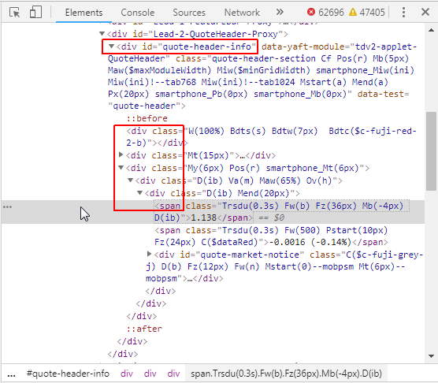
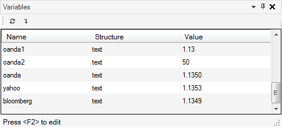

# Currency Reaper: Web Scraping, Google Docs and Schedule Trigger

The Internet is full of information and there are many cases when you want to use the data found on the Web. There are many services providing information, which could be harvested for further processing locally. You can copy data from websites and paste it to the application of your choice, but is it possible to automate this task? Of course: it’s called [web scraping](https://en.wikipedia.org/wiki/Web_scraping).

There are several ways to achieve web scraping in G1ANT.Robot. One of them — the simplest and rudimentary in its form — is launching a browser with the `program` command, finding the necessary text, selecting it with appropriate keyboard or mouse commands, copying and then pasting it into a desired application. This approach works and requires just basic knowledge of G1ANT.Language, but sometimes finding the right information on a web page is a bit tricky. Or the selected and copied text needs further filtration to extract just what you need.

The other option is more elegant and doesn’t require dealing with user interface. It communicates directly with a browser, allowing to reach for the data hidden beneath the surface visible to a user. This method is based on the `selenium.` family of commands contained in Selenium Addon. As its name implies, this family leverages the [Selenium](https://www.seleniumhq.org/) browser automation tools.

Imagine you want to check some sites for price changes, best deals, stock quotes, currency rates etc. You want to copy the required numbers to your Google Docs spreadsheet to analyze them later or simply receive alerts when a given figure reaches desired value. And, obviously, the data harvesting should occur regularly, with specified time intervals. Seems hard to execute? Good news: you can do it all with G1ANT.Robot!

## XPath to Knowledge

In this exercise you will write a script, which at a given time opens three websites one after another, grabs EUR/USD currency quotes, opens a Google Docs spreadsheet and inserts this data along with the time the scraping was done into relevant cells in the first available column.

Let’s start with the source of data. For the latest currency rates, OANDA, Yahoo! Finance and Bloomberg are good places to go. OANDA displays rates of many currencies on one page, while the other two services present only major currencies in a ticker. In fact, it doesn’t really matter how the quotes are presented to a user as long as you are able to pin them in the code that builds up the page.

And here is the thing: the items you want to scrap from a webpage are always somewhere in the XML code. Since XML is a structured language (the code is in hierarchical order), it’s possible to find necessary information by navigating to a node — a place in the XML tree, where this data is stored. You can think of it much the same as when searching for a file and the result is a full path to it, such as *C:\Users\g1ant\Documents\file.txt*.

In case of XML, the path to a node is obtained through [XPath](https://en.wikipedia.org/wiki/XPath). But where is this XPath, how can you use it to learn where your data is? The answer lies within your browser and its Inspect tool.

Open [Yahoo! Finance page for EUR/USD quotes](https://finance.yahoo.com/quote/EURUSD=X?p=EURUSD=X) in your browser. Now, right-click the quote and select `Inspect` (Chrome) or `Inspect Element` (Firefox, IE) from the context menu. A new pane will be displayed on the right side (Chrome) or at the bottom (Firefox, IE) of the browser, revealing the code behind the page. Take a look at it — specifically, at the selected line of code. You can see the current quote in black and embraced with `<span></span>` tags — for example, if the quote was 1.1392, the selected code would be as below:

```xml
<span class="Trsdu(0.3s) Fw(b) Fz(36px) Mb(-4px) D(ib)">1.1392</span>
```

Alright, you found the node, where Yahoo! puts the quote to be displayed on their page. Time to copy the path to this node, so that you can easily point a command to it later: right-click the selected element of the code and choose `Copy`, then `XPath` or `Copy XPath`, depending on your browser. Take a look at the XPath to the node you found:

`//*[@id="quote-header-info"]/div[3]/div/div/span[1]`

You could translate it into: find a branch with `"quote-header-info"` ID, then enter the branch of the third `div` element in this branch, go down its first `div` element, then again down the first `div` element inside and stop at the first `span` element. It’s easier to understand this by looking at the element tree in the browser’s inspection pane:



Time for some practicing: go to [OANDA](https://www.oanda.com/currency/live-exchange-rates/) and [Bloomberg](https://www.bloomberg.com/quote/EURUSD:CUR) and do the same hunting for XPaths to EUR/USD quotes. Do you notice that OANDA has a bit different way of presenting the data? Their quotes combine three elements with different formatting for a better readability. Therefore, you will have to use two XPaths to get the full quote (the third element is responsible for the fifth decimal number, which is unnecessary in case of this exercise).

You got sources of your data, so it’s time to use them.

## Selenium Indispensiblum

The `selenium.` family of commands lets you operate a browser of your choice (although in case of Internet Explorer it’s better to use the `ie.` family of command tailored especially for it). You can use it not only to make actions such as opening URLs, activating or closing tabs, clicking specified elements or typing some text, but also to do some more advanced tasks like running a script, setting or getting an attribute of an element or retrieving its value.

The latter sounds exactly as the solution to your scraping needs: the `selenium.gettext` command searches for a specified phrase typical for a desired element and then returns the text assigned to it. In case of this exercise, the phrase is the XPath to the currency quote and the text is the quote itself. The command for the Yahoo! service in your script could look like this:

```G1ANT
selenium.gettext search //*[@id="quote-header-info"]/div[3]/div/div/span[1] by xpath result ♥yahoo
```

The XPath to the quote is given after the `search` argument, the `by` argument specifies XPath as the element selector and the result — the quote — is returned to the `♥yahoo` variable. Easy, right?

You will also need other `selenium.` commands: `selenium.open` and `selenium.close` to launch and close the browser, as well as  `selenium.seturl` to navigate to another service in the same tab after the scraping on the current website is finished.

> **Note:** In order to use `selenium.` commands, the Selenium addon needs to be enabled. Just click the check box next to `selenium` entry in the Addons panel (by default, on the left of the workspace).

Start your script with some ordering work and put all URLs, XPaths and other elements in variables: 

```G1ANT
♥oandaUrl = https://www.oanda.com/currency/live-exchange-rates/
♥oandaXp1 = //*[@id="EUR_USD-b-int"]
♥oandaXp2 = //*[@id="EUR_USD-b-pip"]
♥yahooUrl = https://finance.yahoo.com/quote/EURUSD=X?p=EURUSD=X/
♥yahooXp = //*[@id="quote-header-info"]/div[3]/div/div/span[1]
♥bloomUrl = https://www.bloomberg.com/quote/EURUSD:CUR
♥bloomXp = //*[@id="root"]/div/div/section[2]/div[1]/div/section[1]/section/section[2]/section/div[1]/span[1]
```

As mentioned earlier, OANDA uses three elements for displaying currency quotes, hence two XPaths and their variables for this service (the third element can be neglected).

Let’s write a procedure named `ScrapQuotes`, which will scrap currency quotes from the three services. It will open Chrome browser (you can choose your favorite one, of course), load OANDA’s URL stored in the `♥oandaUrl` variable, then will get values of two elements specified by their XPaths in the `♥oandaXp1` and `♥oandaXp2` variables and store them in the `♥oanda1` and `♥oanda2` variables, respectively (which will then be combined into one value).

These actions will be repeated for the other two websites with their respective URLs and XPaths in variables, only that instead of launching the browser again, the same tab will be used and redirected to a new URL with the `selenium.seturl` command.

When the scraping is done, the browser will close and the procedure will conclude.

```G1ANT
procedure scrapQuotes
    selenium.open chrome url ♥oandaUrl
    delay 5
    selenium.gettext search ♥oandaXp1 by xpath result ♥oanda1
    selenium.gettext search ♥oandaXp2 by xpath result ♥oanda2
    ♥oanda = ♥oanda1 + ♥oanda2

    selenium.seturl ♥yahooUrl
    selenium.gettext search ♥yahooXp by xpath result ♥yahoo

    selenium.seturl ♥bloomUrl
    selenium.gettext search ♥bloomXp by xpath result ♥bloomberg

    selenium.close
end
```

Notice the `delay` command in line 3: this 5-second delay is a fallback in case the browser launches too long, which could disturb the robot process.

Now you can test this concept by running the whole script with two additional lines between variables declarations and the procedure — one for calling the procedure and second for testing what was actually scraped:

```G1ANT
call scrapQuotes
dialog ‴OANDA: ♥oanda, Yahoo: ♥yahoo, Bloomberg: ♥bloomberg‴ 
```

Bloody hell, something went wrong! Did your browser get stuck on Yahoo! website? It’s because of their privacy policy, which needs your input: accepting it by clicking OK in the message box. Fortunately, you are supported here with another `selenium.` command — `selenium.click` — used to “click” the element you provide. As in the `selenium.gettext` command, you give the phrase to search for as a value for the `search` argument and the element selector as a value for the `by` argument.

First, you have to pinpoint the obstacle on Yahoo! just like you did with currency quotes: right-click the OK button, select `Inspect` and in the source code copy the XPath to this element. Assign the copied path to a variable named `♥yahooOk` and add it to the list of declared variables:

```G1ANT
♥yahooOk = /html/body/div/div/div/form/div/button[2]
```

The OK button should be clicked right after Yahoo! website is opened, so insert the `selenium.click` command here:

```G1ANT
    selenium.seturl ♥yahooUrl
    selenium.click search ♥yahooOk by xpath
```

Run the script again and see if it executes smoothly. At its end you should see a dialog box with quotes for the EUR/USD currency pair scraped from the three sources.

Seeing results in a dialog box for just a while isn’t what you really expect from a true robotized web scraping, so it’s time to make a procedure responsible for writing the scraped data to a file. This file should be available to you from anywhere at any time. A document hosted in a cloud service such as Google Sheets will be great for this purpose.

## Holy Sheet!

In addition to MS Office-oriented commands (contained in MSOffice and Xlsx addons), G1ANT.Robot has a special Google Docs set of commands designed to work with Google Sheets — a spreadsheet application of this popular online office suite. These commands, available in GoogleDocs addon, let you perform several actions on spreadsheets and their data in the background, without opening the browser.

> **Note:** In order to use `googlesheet.` commands, the Selenium addon needs to be enabled. Just click the check box next to `googledocs` entry in the Addons panel (by default, on the left of the workspace).

For the purposes of this exercise you just want to open a Google Sheet document and insert scraped currency quotes in three consecutive cells. It’s totally up to you how you want these values organized — vertically or horizontally — but let’s assume they will be placed in one column, row by row. The cells in the first column will be reserved for the names of services, so you will start with column B.

First, a Google Sheet has to be opened with the — surprise! — `googlesheet.open` command. But wait, Google Sheet documents have no filenames, so how do you open them?

Since this is an online service with no typical disk file structure, Google Docs use unique document IDs instead of filenames. These IDs are a part of a document’s URL: a long string of alphanumeric characters following *https://docs.google.com/document/d/*. For example, if the document’s URL is https://docs.google.com/spreadsheets/d/1iCL_st5tCA54jCiLJ7pYScw-3P79A96pxgzeVZmv_aM/, its ID is *1iCL_st5tCA54jCiLJ7pYScw-3P79A96pxgzeVZmv_aM*. 

If you want to use a Google Sheets document, you need to create it first and get its ID for the `googlesheet.open` command. 

> **Note:** In this example we use our testing sheet ID. You should replace it with your own document ID.

Let’s assign the document ID to a variable and add it to the list of declared variables at the beginning of the script:

```G1ANT
♥googleId = 1iCL_st5tCA54jCiLJ7pYScw-3P79A96pxgzeVZmv_aM
```

Now you can write a procedure named, say, `googleSheet`, which opens your Google Sheet document and sets values for three consecutive cells in column B using quotes stored in variables:

```G1ANT
procedure googleSheet
    googlesheet.open ♥googleId
    googlesheet.setvalue B2 value ♥oanda
    googlesheet.setvalue B3 value ♥yahoo
    googlesheet.setvalue B4 value ♥bloomberg
end
```

Before you test what you just wrote, add a procedure call replacing the previous `dialog` command. Your script should look like this:

```G1ANT
♥oandaUrl = https://www.oanda.com/currency/live-exchange-rates/
♥oandaXp1 = //*[@id="EUR_USD-b-int"]
♥oandaXp2 = //*[@id="EUR_USD-b-pip"]
♥yahooUrl = https://finance.yahoo.com/quote/EURUSD=X?p=EURUSD=X/
♥yahooOk = /html/body/div/div/div/form/div/button[2]
♥yahooXp = //*[@id="quote-header-info"]/div[3]/div/div/span[1]
♥bloomUrl = https://www.bloomberg.com/quote/EURUSD:CUR
♥bloomXp = //*[@id="root"]/div/div/section[2]/div[1]/div/section[1]/section/section[2]/section/div[1]/span[1]
♥googleId = 1iCL_st5tCA54jCiLJ7pYScw-3P79A96pxgzeVZmv_aM

call scrapQuotes
call googleSheet

procedure scrapQuotes
    selenium.open chrome url ♥oandaUrl
    delay 5
    selenium.gettext search ♥oandaXp1 by xpath result ♥oanda1
    selenium.gettext search ♥oandaXp2 by xpath result ♥oanda2
    ♥oanda = ♥oanda1 + ♥oanda2

    selenium.seturl ♥yahooUrl
    selenium.click search ♥yahooOk by xpath
    selenium.gettext search ♥yahooXp by xpath result ♥yahoo

    selenium.seturl ♥bloomUrl
    selenium.gettext search ♥bloomXp by xpath result ♥bloomberg

    selenium.close
end

procedure googleSheet
    googlesheet.open ♥googleId
    googlesheet.setvalue B2 value ♥oanda
    googlesheet.setvalue B3 value ♥yahoo
    googlesheet.setvalue B4 value ♥bloomberg
end
```

Run the script and see what happens.

Sheet happens: the Robot encounters a problem right after it opens your Google Sheets document and tries to set the first cell’s value. The error message reads *“Input string was not in a correct format”*. What does it mean, exactly?

Data structure (type) is the culprit. The `selenium.gettext` command literally gets text and if you take a closer look at the Variables panel, the resulting variables `♥oanda`, `♥yahoo` and `♥bloomberg` are of `text` structure.



It doesn’t impose any problems as long as you don’t want to use this variables in places where numbers are expected, not text. Unfortunately for you, the `googlesheet.setvalue` command uses number values by default. You can bypass this requirement with the `numeric` argument set to `false` (eg. `googlesheet.setvalue B2 value ♥oanda numeric false`), but if you would want to use the data in your sheet for further processing, it’s really a bad idea — you can’t perform any mathematical operations on text.

The solution is to convert text into a number. This operation is called datatype casting. In G1ANT.Language you can change the type (we call it *structure*) of a variable, using this syntax:

```G1ANT
♥variable = structure♥variable
```

For example, if you want to change the structure of the `♥oanda` variable into integer, you would write `integer♥oanda`.

In case of this exercise, you need your variables to be of `float` structure, because the quotes are floating point numbers:

```G1ANT
♥oanda = float♥oanda
♥yahoo = float♥yahoo
♥bloomberg = float♥bloomberg
```

> **Note:** If your operating system locale (regional settings) is set to other than British/American or others that use a dot (.) as a decimal point, you must set the `♥locale` special variable. It forces the robot to use the specified locale and here it will allow to correctly convert text into a floating point number. Just put this line at the beginning of your script:
>
> ```G1ANT
> ♥locale = en-US
> ```

Insert these lines at the end of the `scrapQuotes` procedure and run the script again. This time it should execute flawlessly. Remember that the `googlesheet.` commands work silently in the background, directly communicating with the Google Sheets documents without launching your default browser. Open your Google Sheets document to see the results.

If everything is OK, save your script (use a common **Ctrl+S** keyboard shortcut or click the  icon) under whatever name you want and wherever you want. Be sure to remember where it was saved, though. You will need this file soon.

## Robot Scheduling

It would be a nice feature to have this script run in regular time intervals, so you can collect the currency quotes throughout a day, for instance. G1ANT.Robot allows this via schedule triggering: all you have to do is to set a trigger in robot’s settings and then activate it.

1. Select `Settings` from `Tools` menu.
2. In the resulting Settings window, navigate to the `Triggers` entry. Right-click it and select `Add` from the context menu.
3. Expand the `Triggers` entry by clicking its arrow on the left. You should see a new entry with the default `trigger1` name. Expand it.
4. Click the field next to the `TaskName` entry and enter the full path to the robot script file you have just saved. This is the script to be run by the trigger.
5. Click the field next to the `Class` entry and type `ScheduleTrigger` (there are also file triggers and mail triggers available).
6. Right-click the `Arguments` entry and select `Add` from the context menu.
7. Expand the resulting `argument1` entry, click the field next to the `Key` entry and type `CrontabExpression`.
8. Click the field next to the `Value` entry and type your crontab expression.

Crontab expressions are used to provide schedule information (time and day) in a simple way. You can use [this site](http://www.cronmaker.com/) to generate or [this site](https://crontab.guru/) to test your crontab expressions written with this syntax:

`minute hour(s) day month day-of-a-week`

Values can include an asterisk (`*`) as any value, lists separated with commas (e.g. `10,25,50` as minutes), ranges set with a hyphen (e.g. `9-12` as hours), step values defined with a slash (e.g. `*/1` in minutes means “every minute”) and combinations of above (such as `8-11,15-18` in hours meaning “from 2 to 4 AM and from 3 to 6 PM” or `1-6/2` meaning “every 2nd day of a week from Monday through Saturday”). For example, if you want your robot to start every hour on the hour from 9 AM to 5 PM on working days (Monday till Friday), the crontab expression would be:

`0 9-17 * * 1-5`

For testing purposes, you can set your schedule trigger to simply run the script every 5 minutes:

`0/5 * * * *`

After you have entered your schedule as the crontab expression, click OK, close the window and click OK in the message box. Your schedule trigger is ready to go, so activate it by selecting `Active` from `Triggers` menu and wait for the moment your script is started.

Everything should work fine except for one thing: with every script execution the previous data in your Google Sheets document is overwritten with new values. What about moving the robot to the next column when it’s triggered? Great idea, but how can you do it when all variables are reset each time the robot runs the script?

## File Logging

When there is no way to use variables for storing values, as in the case of triggering (every time a script is run, it’s variables are reset), you have to resort to some external containers such as good old text files, where you can keep things for later use.

In case of this exercise, you would want to have a file for storing information on the spreadsheet column that was used last time the script was triggered. This column letter would be retrieved when the script is run, so that the next column would be used for the current process.

You already know the `text.` family of commands from the [second exercise](https://manual.g1ant.com/link/G1ANT.Manual/g1ant-language/practical-robot/02-unsubscribe-me.md) of Practical Robot chapter. You will use the `text.read` and `text.write` commands to read the previous column letter from a file and write the current one, overwriting the file’s existing content.

Start with defining the name for your log file and assigning it to a variable:

```G1ANT
♥logFileName = log.txt
```

This file will be placed in the robot’s default working directory — the directory the robot was run from. If you want to place it somewhere else, just provide the full path here.

Create a procedure for checking the column that was used previously and setting a new column. It will use the `text.read` command to read the contents of a log file and then will use a C# snippet to “increase” the column letter by one:

```G1ANT
procedure checkColumn
    text.read ♥logFileName result ♥prevCol
    ♥currentCol = text⊂(char)(♥prevCol[0] + 1)⊃
end
```

The log file content is read and assigned to the `♥prevCol` variable. In the next line the C# snippet converts the letter stored in the `♥prevCol` variable into its ASCII value (`♥prevCol[0]`), then this value is increased by 1 and the result is converted back to a letter with the C# `char` keyword. The final action is to assign the result of the C# snippet as a text to the `♥currentCol` variable.

Splendid, but what about the log file when the robot script is run for the first time? There is none, so either you have to create it manually before you run the script, or you can robotize this job as well using the `file.exists` command. It will check whether a log file exists, and if it’s not there, the command would normally show an error, but you can be smart and leverage that.

The `file.exists` command shares [common arguments](https://manual.g1ant.com/link/G1ANT.Manual/appendices/common-arguments.md) with four error handlers: `errorcall`, `errorjump`, `errormessage` and `errorresult`. They step in when an error occurs, and the first two are the perfect choice for executing special code in case something goes wrong.

If your `file.exists` command couldn’t find the log file and you’d use the `errorjump` argument, the robot would jump to the label, where it would create a new log file. But after creating this file, the robot wouldn’t get back, but would rather continue executing lines of code placed after the labeled block. It means that you would have to put the labeled block right after the line the `CheckColumn` procedure was called. And what about the column letter processing, which is still inside the procedure?

It’s better to use the `errorcall` argument instead, so when the log file is not found, a special procedure is called — say, `createLogFile` — where a log file is created and then the robot returns to the `checkColumn` procedure to continue column letter processing as if a log file was there from the start.

First, add this line at the beginning of the `checkColumn` procedure:

```G1ANT
file.exists ♥logFileName errorcall createLogFile
```

Now create the `createLogFile` procedure, which sets the start column letter to A and saves the file under the name of your log file:

```G1ANT
procedure createLogFile
    ♥startCol = A
    text.write ♥startCol filename ♥logFileName
end
```

We mentioned that the first column in your spreadsheet is reserved for website names, so why “A” and not “B” as the first column letter? Because when the procedure ends, the robot returns to the `checkColumn` procedure and the next executed line — the one with a C# snippet — sets the next column as the starting point.

When all currency quotes are scraped and written to your spreadsheet, the column index should be updated in the log file by overwriting its content. You can do this with another `text.write` command with the `writemode override` argument.

Create a separate procedure named `updateLog`, for example:

```G1ANT
procedure updateLog
     text.write ♥currentCol filename ♥logFileName writemode override
end
```

You are almost done. Now use the current column letter stored in the `♥currentCol` variable to set values in proper cells of your Google Sheets document. Replace the fixed cell addresses in the `GoogleSheet` procedure with variable ones:

```G1ANT
procedure googleSheet
    googlesheet.open ♥googleId
    googlesheet.setvalue ♥currentCol+2 value ♥oanda
    googlesheet.setvalue ♥currentCol+3 value ♥yahoo
    googlesheet.setvalue ♥currentCol+4 value ♥bloomberg
end
```

The cell addresses are now created by composing the current column index and a number: B2, B3, B4, then C2, C3, C4 and so on.

It would be great to know when these quotes were scraped — for example, you could have a time stamp given in hours and minutes as the title of a column, so you could easily track changes in your spreadsheet. No problem! You can use the `♥date` [special variable](https://manual.g1ant.com/link/G1ANT.Manual/appendices/special-variables.md), which provides current date and time, but for your purposes limited to hours and minutes — and this is done with another special variable, `♥dateformat`, which defines a date display format for the `♥date` variable.

Just add this line to the list of declared variables:

```G1ANT
♥dateformat = HH:mm
```

And this one to your GoogleSheet procedure in the line right after the `googlesheet.open` command:

```G1ANT
    googlesheet.setvalue ♥currentCol+1 value ♥date numeric false
```

Notice the `numeric false` argument: as we mentioned before, it allows to enter a non-numeric value into a spreadsheet cell.

When you add missing `checkColumn`, `createLogFile` and `updateLog` procedure calls, you will get this final code:

```G1ANT
♥oandaUrl = https://www.oanda.com/currency/live-exchange-rates/
♥oandaXp1 = //*[@id="EUR_USD-b-int"]
♥oandaXp2 = //*[@id="EUR_USD-b-pip"]
♥yahooUrl = https://finance.yahoo.com/quote/EURUSD=X?p=EURUSD=X/
♥yahooOk = /html/body/div/div/div/form/div/button[2]
♥yahooXp = //*[@id="quote-header-info"]/div[3]/div/div/span[1]
♥bloomUrl = https://www.bloomberg.com/quote/EURUSD:CUR
♥bloomXp = //*[@id="root"]/div/div/section[2]/div[1]/div/section[1]/section/section[2]/section/div[1]/span[1]
♥googleId = 1iCL_st5tCA54jCiLJ7pYScw-3P79A96pxgzeVZmv_aM
♥dateformat = HH:mm
♥logFileName = log.txt

call checkColumn
call scrapQuotes
call googleSheet
call updateLog

procedure checkColumn
    file.exists ♥logFileName errorcall createLogFile
    text.read ♥logFileName result ♥prevCol
    ♥currentCol = ⊂(char)(♥prevCol[0] + 1)⊃
end

procedure createLogFile
    ♥startCol = A
    text.write ♥startCol filename ♥logFileName
end
    
procedure scrapQuotes
    selenium.open chrome url ♥oandaUrl
    delay 5
    selenium.gettext search ♥oandaXp1 by xpath result ♥oanda1
    selenium.gettext search ♥oandaXp2 by xpath result ♥oanda2
    ♥oanda = ♥oanda1 + ♥oanda2

    selenium.seturl ♥yahooUrl
    selenium.click search ♥yahooOk by xpath
    selenium.gettext search ♥yahooXp by xpath result ♥yahoo

    selenium.seturl ♥bloomUrl
    selenium.gettext search ♥bloomXp by xpath result ♥bloomberg

    ♥oanda = float♥oanda
    ♥yahoo = float♥yahoo
    ♥bloomberg = float♥bloomberg

    selenium.close
end

procedure googleSheet
    googlesheet.open ♥googleId
    googlesheet.setvalue ♥currentCol+1 value ♥date numeric false
    googlesheet.setvalue ♥currentCol+2 value ♥oanda
    googlesheet.setvalue ♥currentCol+3 value ♥yahoo
    googlesheet.setvalue ♥currentCol+4 value ♥bloomberg
end

procedure updateLog
     text.write ♥currentCol filename ♥logFileName writemode override
end
```

