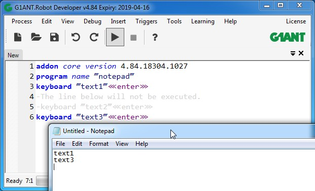

# Comment

## **Syntax**

```text
-keyboard ‴text2‴⋘enter⋙
```

## **Description**

Comment character `-` is used to add a comment to the code.

G1ANT.Robot has a built-in comments feature, meaning you can comment out certain lines of code and G1ANT.Robot will not execute them while reading the script line by line. Or, you can simply “turn off” a chosen script line — see the example below.

### **Example**

```text
program name ‴notepad‴
keyboard ‴text1‴⋘enter⋙
-The line below will not be executed.
-keyboard ‴text2‴⋘enter⋙
keyboard ‴text3‴⋘enter⋙
```

In this example you can see what happens in G1ANT.Robot window when lines of comments are typed starting with `-` character.

The first commented out line of script is a simple text: `-The line below will not be executed.`  
The other commented out line is a command \(`-keyboard ‴text2‴⋘enter⋙`\) that would perform an action if it wasn’t commented out.



