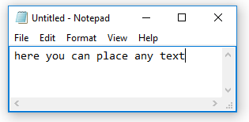

# Text

## **Syntax**

```text
‴The text to use or save‴
```

## **Description**

Text special characters `‴‴` are required to declare text value within all available commands. This text can be used for displaying messages, storing file paths containing spaces, as an input in documents or dialog boxes etc., and can also be assigned to variables.

You can insert this character from `Insert/Text` menu or with **Ctrl+'** \(apostrophe\) keyboard shortcut.

### **Example**

```text
program name ‴notepad‴
keyboard ‴here you can place any text‴
```



In the first line the text contained within triple quotes is a name of the program to be run. The text in the next line should be entered by the `keyboard` command in the launched program.

