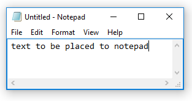

# Variable

## **Syntax**

```text
♥myvar = ‴some text‴
```

```text
♥myvarnumber = 773
```

## **Description**

The variable special character `♥` is placed before the name of a variable. Any value from all possible types of structures can be assigned to a variable.

You can insert this character from `Insert/Variable` menu or with **Ctrl+4** keyboard shortcut.

### **Example**

```text
♥text = ‴text to be placed to notepad‴
program name ‴notepad‴
keyboard ♥text
```



