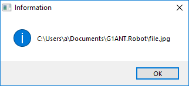
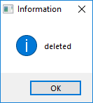

# File Trigger

File Trigger monitors files in the specified folder and provides information whether they were changed, deleted, renamed or there are some new created files.

## Initial Arguments

| Trigger Argument | Required | Default value | Description |
| -------- | ---- | -------- | ------------- |
| `Directory` | yes | - | Path of the folder to monitor |
| `Filter` | no |  `*.*` | Determines what files are monitored in a directory, all files are watched by default (`*.*`) |
| `AddExistingFilesAtStart` | no | false | Determines whether all initially existing files will be triggered or not |

## Task Arguments

Arguments generated while executing the script for each of the file in the monitored folder.

| Trigger Argument | Description |
| -------- | ---- |
| `FilePath` | Path to a file in the monitored folder |
| `FileName` | Name of the file (with extension) |
| `FileNameWithoutExtension` | Name of the file (without extension) |
| `ChangeType` | Information about the type of modification that was applied to a file (created, changed, deleted or renamed) |
| `OldFilePath` | Path to the file that has been changed |

## Example of Defining a File Trigger in Settings

```G1ANT
<Trigger Class="FileTrigger" Name="test" TaskName="C:\Users\a\Documents\G1ANT.Robot\test.robot">
	<Arguments>
		<Argument Key="Directory">C:\Users\a\Documents\G1ANT.Robot</Argument>
	</Arguments>
</Trigger> 
```

## Example

```G1ANT
dialog ♥taskfilepath
dialog ♥taskchangetype
```


