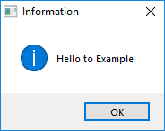
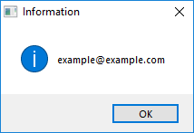

# Mail Trigger

Mail Trigger provides information about incoming emails.

## Initial Arguments

| Trigger Argument | Required | Default value | Description |
| -------- | ---- | -------- | ------------- |
| `Host` | yes | - | IMAP server address |
| `Login` | yes | - | Login (e.g. email address) for the account the emails will be sent from |
| `Password` | yes | - | Password for this email account |
| `Frequency` | no | 30000 | Time interval between updates on incoming emails (in milliseconds) |
| `Port` | yes | - | Incoming mail server port |

## Task Arguments

Arguments generated while executing the script for each incoming email:

| Trigger Argument | Description |
| -------- | ---- |
| `Title` | The title of an incoming mail |
| `AttachmentNames` | A list of attachments in an incoming mail |
| `Content` | Incoming mail content (text) |
| `From` | Sender's email address |
| `To` | Recipient's email address |
| `HtmlBody` | Incoming mail content (html) |
| `Uid` | A unique identifier of a mail given by a server |
| `Date` | Sent date |
| `Priority` | Priority set by a sender |

## Example of Defining a Mail Trigger in Settings

```G1ANT
<Trigger Class="MailTrigger" Name="test" TaskName="C:\Users\a\Documents\G1ANT.Robot\test.robot">
	<Arguments>
		<Argument Key="Host">imap.gmail.com</Argument>
		<Argument Key="Login">example@example.com</Argument>
		<Argument Key="Password">example123</Argument>
		<Argument Key="Frequency">300000</Argument>
		<Argument Key="Port">993</Argument>
	</Arguments>
</Trigger> 
```

## Example

```G1ANT
dialog ♥tasktitle
dialog ♥taskto
```

 
