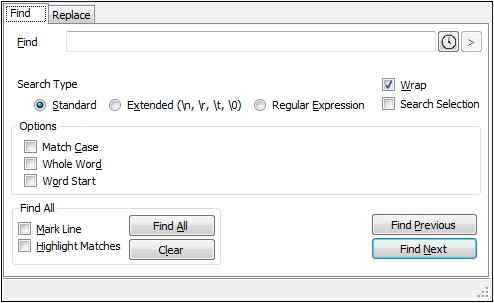

# Find and Replace

The `Find and Replace` window is common across applications. It allows searching for specified strings  \(`Find` tab\) and replacing them with new content \(`Replace` tab\). It's accessible from `Edit/Find` or `Edit/Replace` menu, or with **Ctrl+F** and **Ctrl+H** keyboard shortcuts, respectively.

There are several options available for finding and/or replacing text:

| Option | Description |
| :--- | :--- |
| **Standard** | Simply finds the text specified in `Find` input box with options to find text matching case only, a whole word \(the text to be found surrounded by characters other than letters and digits\) or word start \(characters other than letters and digits space only before the text to be found\) |
| **Extended** | With this option selected, you can also search for special characters such as new line or tabulator. There are also further options related to C\# language |
| **Regular Expression** | This option allows for sophisticated searches using _regular expression_ \(regex\) syntax. For more information on regex, please refer to a [Wikipedia entry](https://en.wikipedia.org/wiki/Regular_expression) and the [Regex Appendix](https://docs.g1ant.com/~/drafts/-LQdLHAMSyhFccoEjtsF/primary/appendices/regex) to this manual |
| **Wrap** | Wraps text in Find/Replace input box \(when the text exceeds the box width\) |
| **Search Selection** | Limits your search to the text selected in the script editor instead of the whole project |
| **Find All** | Finds all matches and allows to mark the line containing the match and/or highlight the matches. |

