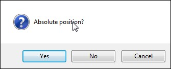

# Mouse Position

This tool inserts mouse position in absolute or relative (to the active window) values. It's accessible from `Insert/Mouse Position` menu or with **Ctrl+E** keyboard shortcut.

When you open this tool, you are prompted to choose absolute or relative measurement:

Right after clicking your answer, the screen grays out and you can point your mouse cursor to the desired position. When you click the left mouse button, the current mouse position will be inserted into your code as a value of [`point`](https://manual.g1ant.com/link/G1ANT.Language/G1ANT.Language/Structures/PointStructure.md) structure.

