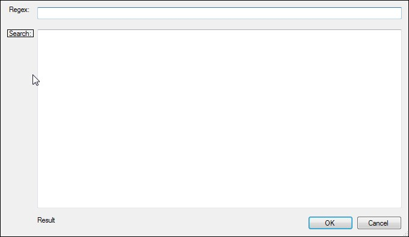

# Regex

This tool allows to use regular expressions \(regex\) on a sample text. You can access its window by selecting `Insert/Regex` menu or with **Ctrl+U** keyboard shortcut.

Paste your text into `Search` box and start typing regular expression in `Regex` box. The results will be shown at the bottom of the window.

For more information on regex, please refer to a [Wikipedia entry](https://en.wikipedia.org/wiki/Regular_expression) and the [Regex Appendix](../../appendices/regex.md) to this manual.

