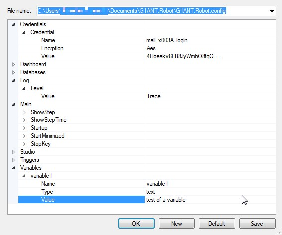

# Settings

The command center of G1ANT.Robot is available from `Tools/Settings` menu. It offers all program settings, as well as other global options such as triggers and variables to be shared by all scripts.

The Settings window is a front-end to G1ANT.Robot.config XML file. Its path is displayed in the `File name` box.

| Item            | Description                                                  |
| --------------- | ------------------------------------------------------------ |
| **Credentials** | Shows items stored in the [Credential Container](https://manual.g1ant.com/link/G1ANT.Manual/g1ant.robot-window/auxiliary-windows/credential-container.md). This branch cannot be edited here, no new credentials can be added — to add or change credentials, use Credential Container window. |
| **Dashboard**   | Not used at the moment                                       |
| **Databases**   | Not used at the moment                                       |
| **Log**         | Not used at the moment                                       |
| **Main**        | Allows determining basic parameters for the program: **ShowStep** and **ShowStepTime** are not used **Startup** — if its value is set to true, G1ANT.Robot will start with Windows **StartMinimized** — if its value is set to true, G1ANT.Robot will start minimized **StopKey** defines the keyboard shortcut used to stop current process execution (**Ctrl+F12** by default) |
| **Studio**      | Controls workspace look and behavior: **Styling** — if its value is set to true, G1ANT.Robot will use G1ANT.Language syntax coloring for scripts **WordWrap** — if its value is set to true, the lines of code will wrap **Font** — lets choose font family and size for the script editor **Shortcut** — displays keyboard shortcuts changed by a user |
| **Triggers**    | This is the place for setting up new [triggers](https://manual.g1ant.com/link/G1ANT.Addon.Core/G1ANT.Addon.Core/Triggers/DESCRIPTION.md) (based on [file](https://manual.g1ant.com/link/G1ANT.Addon.Core/G1ANT.Addon.Core/Triggers/FileTrigger.md), [mail](https://manual.g1ant.com/link/G1ANT.Addon.Core/G1ANT.Addon.Core/Triggers/MailTrigger.md) or [schedule](https://manual.g1ant.com/link/G1ANT.Addon.Core/G1ANT.Addon.Core/Triggers/ScheduleTrigger.md) events) or modifying existing ones. To add a new trigger, right-click **Triggers** item and choose `Add`. To delete a particular trigger, right-click it and choose `Remove`. |
| **Variables**   | Here you can declare global variables to be used by all scripts run by this G1ANT.Robot. To add a new variable, right-click **Variables** item and choose `Add`. To delete a particular variable, right-click it and choose `Remove`. |

