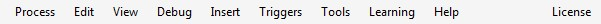

# Menu

### Process

This menu, usually called **File** in other applications, is used to start a new process or open an existing one, and save your work to a file. It also allows to show statistical info about the project.

### Edit

A commonly known menu to perform actions using Clipboard, undo/redo operations, search for some text and do other editing tasks.

### View

From this menu, you can choose which panels should be displayed in the program window.

### Debug

Provides tools for running and debugging your robot script.

### Insert

Allows to insert special objects \(such as program names, mouse position or captured image\) and symbols used in G1ANT language into your code.

### Triggers

In this menu you will find tools related to triggers.

### Tools

Helpful tools such as active windows list, Credential Container or keyboard shortcut list, are available from here.

### Learning

This is the place to start from, when you are new to G1ANT.Robot. Tutorials to the rescue!

### Help

Whenever you are lost, stuck or bugged, get some help here.

