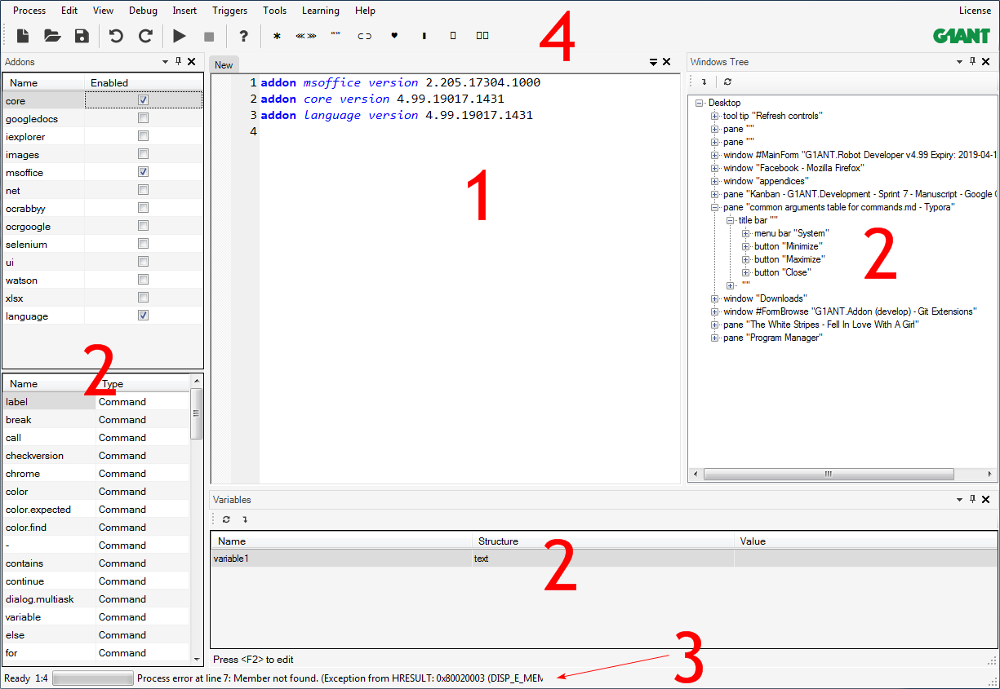

# Overview

The main G1ANT.Robot program window is composed of four elements:

1. The **workspace** a.k.a. the script editor is the place where you type your code. The workspace is tabbed: you can have many robot scripts opened at the same time, each in its own tab.

2. [**Panels**](panels.md) provide additional information related to the G1ANT.Language and your script. On the screenshot above, on the left you can see the Addons panel along with the list of a selected addon elements, the Variables panel at the bottom, which displays all variables currently in use by a script, with their values and structure information, and the Windows Tree panel on the right displaying information on opened windows and their elements.

   You can show/hide the panels by selecting them from the `View` menu.

3. **Status bar** displays the following information, starting from the left:

   - Program status: *“Ready”* means that the robot is able to execute process, *“Process has finished”* or *“Process error at line...”* are self-explanatory.
   - Current cursor position in a script in a *column:row* format
   - Progress bar, which visualizes the progress of the current process
   - Process/Program status displaying information about the current process’ status.

4. [**Menu**](menu.md) and [**Toolbar**](toolbar.md).
