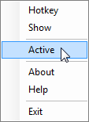

# System Tray Menu

G1ANT. Robot system tray menu can be accessed by right-clicking the green G icon in your system tray

Menu items:

| Item       | Function                                          |
| ---------- | ------------------------------------------------- |
| **Hotkey** | Allows to run the process                         |
| **Show**   | Brings the G1ANT.Robot window to the front        |
| **Active** | Toggle triggers on and off                        |
| **About**  | Info about the current version                    |
| **Help**   | Opens the default browser and displays the manual |
| **Exit**   | Exits G1ANT.Robot program                         |