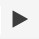

# Toolbar

G1ANT.Robot's toolbar is pretty simple and self-explanatory:

 Creates new empty robot script

 Opens a robot file

 Saves current robot script to a file

 Undo last action

 Redo last action

 Run the current script

 Stop the running script

 Display Help

The remaining icons represent special characters used in G1ANT.Language for quick and easy inserting them into your robot script
